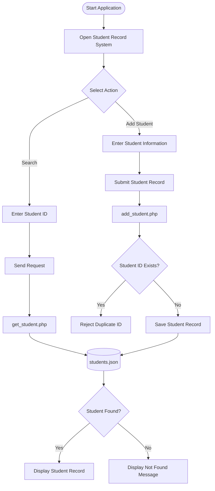
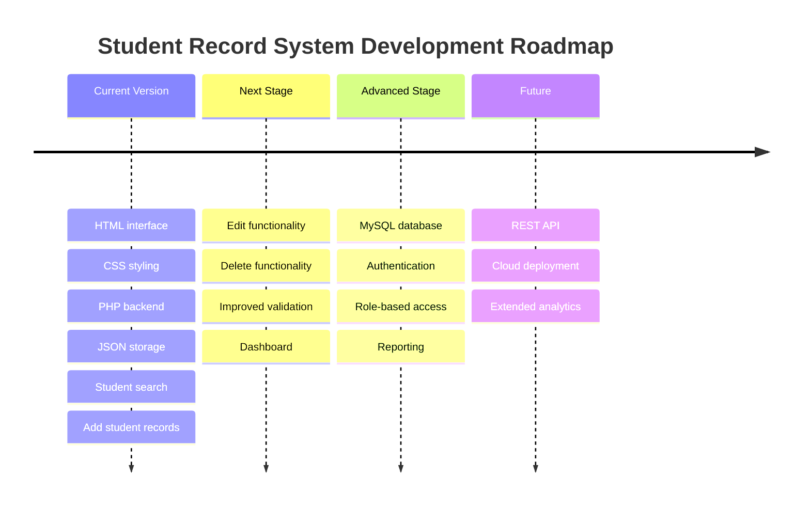

<!-- =========================================================
     STUDENT RECORD SYSTEM
     Author: M.R.Ahamed
     GitHub: Ahamed369
========================================================= -->

<div align="center">

# 🎓 STUDENT RECORD SYSTEM

### Modern • Responsive • Lightweight • PHP-Powered


<br/>


<br/>

[](https://github.com/Ahamed369)
[](https://github.com/Ahamed369/student-record-system)


<br/>

**A lightweight web application for adding, searching, retrieving, and managing student information through a clean browser-based interface.**

</div>

---

## 🌌 Project Overview

The **Student Record System** is a web-based application designed to simplify student information management.

The system provides a straightforward interface for working with student records while combining a lightweight frontend with PHP-based server-side processing and JSON-based data storage.

The project demonstrates practical integration between:

- **HTML5** for application structure
- **CSS3** for visual styling and responsive presentation
- **PHP** for server-side processing
- **JSON** for lightweight record storage
- **JavaScript** within the frontend for interactive browser functionality

The application is intentionally lightweight and does not require a full relational database server for its current implementation.

---

<div align="center">

## ⚡ Technology Stack


<br/><br/>

| Technology | Role |
|:---:|:---|
| 🟠 **HTML5** | Page structure and user interface |
| 🔵 **CSS3** | Styling, layout and responsive presentation |
| 🟣 **PHP** | Backend request processing |
| 🟡 **JavaScript** | Client-side interaction |
| ⚫ **JSON** | Lightweight student record storage |
| 🟠 **Git** | Source-code version control |
| ⚪ **GitHub** | Repository hosting and project management |

</div>

---

## 🚀 Core Features

<table>
<tr>
<td width="50%" valign="top">

### 🔎 Student Search

Search for student information using a student ID through the main application interface.

</td>
<td width="50%" valign="top">

### ➕ Add Student Records

Add new student information through the application and process the submitted data through PHP.

</td>
</tr>

<tr>
<td width="50%" valign="top">

### 🆔 Student ID Validation

The backend checks existing records to help prevent duplicate student IDs.

</td>
<td width="50%" valign="top">

### 📦 JSON Data Storage

Student information is maintained using a lightweight JSON-based storage approach.

</td>
</tr>

<tr>
<td width="50%" valign="top">

### 📱 Responsive Interface

The application uses a browser-friendly layout designed to remain usable across different screen sizes.

</td>
<td width="50%" valign="top">

### ⚡ Lightweight Architecture

No heavy framework or database server is required for the current implementation.

</td>
</tr>
</table>

---

## 🧩 Application Architecture

```text
                    ┌─────────────────────────────┐
                    │          USER               │
                    │       Web Browser           │
                    └──────────────┬──────────────┘
                                   │
                                   ▼
                    ┌─────────────────────────────┐
                    │        index.html           │
                    │                             │
                    │  User Interface             │
                    │  Search Interface           │
                    │  Add Student Interface      │
                    │  Client-Side Interaction    │
                    └──────────────┬──────────────┘
                                   │
                    ┌──────────────┴──────────────┐
                    │                             │
                    ▼                             ▼
       ┌────────────────────────┐    ┌────────────────────────┐
       │    add_student.php     │    │    get_student.php     │
       │                        │    │                        │
       │  Add Records           │    │  Retrieve Records      │
       │  Validate Student ID   │    │  Search by Student ID  │
       └────────────┬───────────┘    └────────────┬───────────┘
                    │                             │
                    └──────────────┬──────────────┘
                                   │
                                   ▼
                    ┌─────────────────────────────┐
                    │       students.json         │
                    │                             │
                    │    Student Data Storage     │
                    └─────────────────────────────┘
```

---

## 📂 Project Structure

```text
student-record-system/
│
├── 📄 index.html
│   └── Main application interface
│
├── 🎨 styles.css
│   └── Application styling and layout
│
├── ⚙️ add_student.php
│   └── Processes and stores new student records
│
├── 🔍 get_student.php
│   └── Retrieves student information
│
├── 🗃️ students.json
│   └── Stores student records
│
└── 📘 README.md
    └── Project documentation
```

---

## 🔄 Application Workflow



---

## 🧠 How the System Works

### 01 — Frontend

`index.html` provides the primary application interface. Users can interact with the student search functionality and the form used for adding records.

### 02 — Styling

`styles.css` controls the application's visual appearance, including layout, spacing, typography and responsive presentation.

### 03 — Add Student Processing

`add_student.php` receives student information from the frontend and handles the logic required to store new records.

Before adding a record, the system checks whether the supplied student ID already exists.

### 04 — Student Retrieval

`get_student.php` handles requests for retrieving student information using a supplied student ID.

### 05 — Data Storage

`students.json` acts as the project's lightweight data store.

This approach keeps the application simple and makes it suitable for demonstrations, coursework, prototypes and smaller applications.

---

<div align="center">

## 🎯 Project Highlights


</div>

---

## 🛠️ Installation & Local Setup

Because the project contains PHP files, opening `index.html` directly is not sufficient for all application functionality. Run the project through a PHP-capable local server.

### Option 1 — PHP Built-In Server

Clone the repository:

```bash
git clone https://github.com/Ahamed369/student-record-system.git
```

Enter the project directory:

```bash
cd student-record-system
```

Start the PHP development server:

```bash
php -S localhost:8000
```

Then open:

```text
http://localhost:8000
```

### Option 2 — XAMPP

1. Install **XAMPP**.
2. Copy the project folder into the `htdocs` directory.
3. Start **Apache** from the XAMPP Control Panel.
4. Open your browser.
5. Navigate to:

```text
http://localhost/student-record-system/
```

---

## 💻 Development Setup

Recommended development environment:

```text
Editor       : Visual Studio Code
Versioning   : Git
Repository   : GitHub
Frontend     : HTML5 + CSS3 + JavaScript
Backend      : PHP
Storage      : JSON
```

---

## 🔐 Validation & Data Handling

The project includes backend logic for working with student IDs and stored student records.

One important validation mechanism is duplicate student-ID detection. Before a new record is accepted, existing records can be checked to determine whether the supplied student ID is already present.

For a production deployment, additional controls should be introduced, including stronger input validation, authentication, authorization, concurrency-safe storage, server configuration hardening and a production-grade database.

---

## 📈 Future Development

The current lightweight architecture can be extended with:

- MySQL database integration
- Administrator authentication
- Role-based access control
- Student record editing
- Student record deletion
- Advanced search and filtering
- Pagination
- Student profile photographs
- Dashboard statistics
- Data export
- Reporting
- Audit logging
- REST API architecture
- Improved server-side validation
- Deployment configuration

---

## 🗺️ Development Roadmap



---

## 🧪 Example Usage

### Search for a Student

```text
1. Open the application
2. Locate Student ID search
3. Enter the required Student ID
4. Submit the search
5. Review the returned student information
```

### Add a Student

```text
1. Open the Add Student section
2. Enter the required information
3. Provide a unique Student ID
4. Submit the form
5. PHP validates the request
6. The record is stored in students.json
```

---

<div align="center">

# 🐍 Contribution Snake


</div>

> **Note:** The contribution snake requires the `Ahamed369` profile repository to generate the snake SVG through GitHub Actions. If that SVG has not been generated in the profile repository yet, GitHub cannot display it. The Student Record System itself does not depend on this graphic.

---

<div align="center">

## 📊 GitHub Activity


</div>

---

<div align="center">

## 🧑‍💻 Developer


### M.R.Ahamed

**Computer Science Undergraduate • Full-Stack Developer**

[](https://github.com/Ahamed369)
[](https://github.com/Ahamed369/student-record-system)

</div>

---

## 🤝 Contributions

Contributions, suggestions and improvements are welcome.

A standard contribution workflow is:

```bash
git clone https://github.com/Ahamed369/student-record-system.git
cd student-record-system
git checkout -b feature/your-feature
```

After making changes:

```bash
git add .
git commit -m "Add new feature"
git push origin feature/your-feature
```

Then open a pull request through GitHub.

---

## ⭐ Support the Project

If you find the project useful, you can support it by:

- ⭐ Starring the repository
- 🍴 Forking the project
- 🐛 Reporting issues
- 💡 Suggesting improvements
- 🔀 Contributing through pull requests

---

## 📌 Repository

<div align="center">

[](https://github.com/Ahamed369/student-record-system)

</div>

---

## 📜 Project Information

```text
Project Name    : Student Record System
Repository      : student-record-system
Developer       : M.R.Ahamed
GitHub          : Ahamed369
Frontend        : HTML5 / CSS3 / JavaScript
Backend         : PHP
Data Storage    : JSON
Version Control : Git
Repository Host : GitHub
```

---

<div align="center">


### 💻 Designed & Developed by M.R.Ahamed

**Student Record System**


<br/>


<br/>

**© 2026 M.R.Ahamed**

</div>
