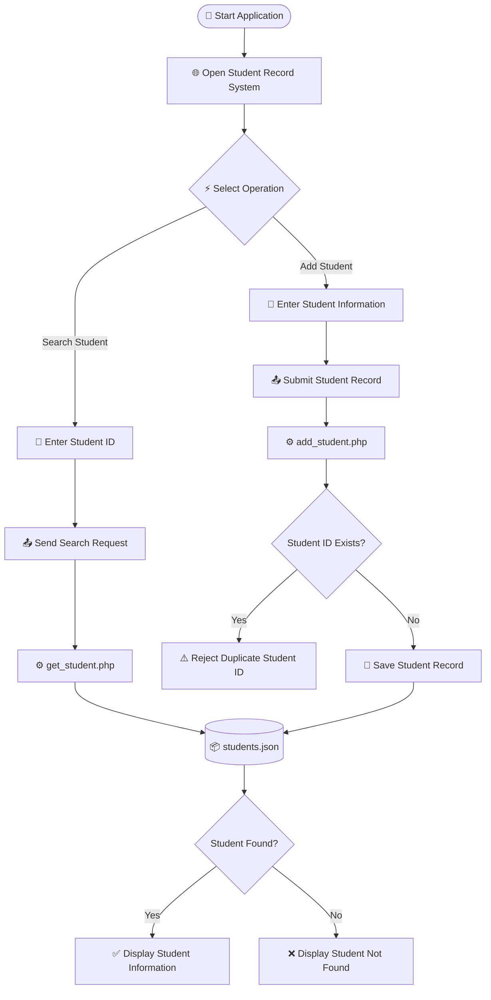
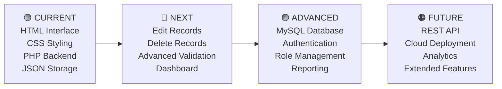

<!-- =========================================================
     STUDENT RECORD SYSTEM
     Developer & Project Owner: M.R.Ahamed
     GitHub: Ahamed369
     Repository: student-record-system
========================================================= -->

<div align="center">


<br/>


<br/><br/>

[](https://github.com/Ahamed369)
[](https://github.com/Ahamed369/student-record-system)


<br/>


<br/>

### 🎓 A Modern Web-Based Student Information Management Solution

**Search • Add • Retrieve • Validate • Store • Manage**

<br/>

> A lightweight student management web application combining a responsive frontend, PHP server-side processing and JSON-based data storage.

</div>

---

# 🌌 Project Overview

The **Student Record System** is a web-based application designed to simplify student information management.

The system provides a straightforward and responsive interface for working with student records while combining a lightweight frontend with PHP-based server-side processing and JSON-based data storage.

The project demonstrates practical integration between:

- 🟠 **HTML5** for application structure
- 🔵 **CSS3** for visual styling and responsive presentation
- 🟡 **JavaScript** for client-side interaction
- 🟣 **PHP** for server-side processing
- ⚫ **JSON** for lightweight student record storage

The application is intentionally lightweight and does not require a full relational database server for its current implementation.

---

<div align="center">

# ⚡ Technology Stack

<br/>


<br/><br/>

| Technology | Purpose |
|:---:|:---|
| 🟠 **HTML5** | Application structure and user interface |
| 🔵 **CSS3** | Styling, layouts and responsive design |
| 🟡 **JavaScript** | Browser-side interaction |
| 🟣 **PHP** | Backend request processing |
| ⚫ **JSON** | Lightweight student data storage |
| 🟠 **Git** | Source-code version control |
| ⚪ **GitHub** | Repository hosting and project management |
| 🔷 **VS Code** | Development environment |

</div>

---

<div align="center">

# 🚀 Core Features

</div>

<table>
<tr>
<td width="50%" valign="top">

### 🔎 Student Search

Search for student information using a unique student ID through the main application interface.

</td>

<td width="50%" valign="top">

### ➕ Add Student Records

Add new student information through the application and process submitted data through PHP.

</td>
</tr>

<tr>
<td width="50%" valign="top">

### 🆔 Student ID Validation

The backend checks existing student records to help prevent duplicate student IDs.

</td>

<td width="50%" valign="top">

### 📦 JSON Data Storage

Student information is maintained through a simple and lightweight JSON-based storage approach.

</td>
</tr>

<tr>
<td width="50%" valign="top">

### 📱 Responsive Interface

The application uses a browser-friendly layout designed to remain usable across different screen sizes.

</td>

<td width="50%" valign="top">

### ⚡ Lightweight Architecture

The current implementation does not require a heavy framework or relational database server.

</td>
</tr>

<tr>
<td width="50%" valign="top">

### ⚙️ PHP Backend

Dedicated PHP endpoints process student creation and student retrieval operations.

</td>

<td width="50%" valign="top">

### 💻 Clean Web Interface

The application provides a straightforward interface designed around essential student record operations.

</td>
</tr>
</table>

---

<div align="center">

# 🎨 Project Highlights


</div>

---

# 🧩 Application Architecture

```text
┌─────────────────────────────────────────────────────────────────────┐
│                                                                     │
│                         👤 APPLICATION USER                          │
│                                                                     │
└───────────────────────────────┬─────────────────────────────────────┘
                                │
                                ▼
┌─────────────────────────────────────────────────────────────────────┐
│                                                                     │
│                           🌐 WEB BROWSER                             │
│                                                                     │
└───────────────────────────────┬─────────────────────────────────────┘
                                │
                                ▼
┌─────────────────────────────────────────────────────────────────────┐
│                           index.html                                │
│                                                                     │
│   ┌─────────────────┐   ┌─────────────────┐   ┌─────────────────┐   │
│   │   User          │   │ Student Search  │   │ Add Student     │   │
│   │   Interface     │   │ Interface       │   │ Interface       │   │
│   └─────────────────┘   └─────────────────┘   └─────────────────┘   │
│                                                                     │
└───────────────────────────────┬─────────────────────────────────────┘
                                │
               ┌────────────────┴────────────────┐
               │                                 │
               ▼                                 ▼
┌────────────────────────────┐      ┌────────────────────────────┐
│      add_student.php       │      │      get_student.php       │
│                            │      │                            │
│  • Add student records     │      │  • Retrieve records        │
│  • Validate student ID     │      │  • Search by student ID    │
│  • Process submitted data  │      │  • Return student data     │
└─────────────┬──────────────┘      └──────────────┬─────────────┘
              │                                    │
              └─────────────────┬──────────────────┘
                                │
                                ▼
┌─────────────────────────────────────────────────────────────────────┐
│                                                                     │
│                        📦 students.json                             │
│                                                                     │
│                       STUDENT DATA STORAGE                          │
│                                                                     │
└─────────────────────────────────────────────────────────────────────┘
```

---

# 📂 Project Structure

```text
student-record-system/
│
├── 📄 index.html
│   ├── Main application interface
│   ├── Student search interface
│   ├── Add student form
│   └── Client-side functionality
│
├── 🎨 styles.css
│   ├── Application styling
│   ├── Layout configuration
│   └── Responsive presentation
│
├── ⚙️ add_student.php
│   ├── Processes new student information
│   ├── Validates student IDs
│   └── Stores new records
│
├── 🔍 get_student.php
│   ├── Processes student search requests
│   └── Retrieves student information
│
├── 🗃️ students.json
│   └── Stores student records
│
└── 📘 README.md
    └── Complete project documentation
```

---

# 🔄 Application Workflow



---

# 🧠 How the System Works

### 01 — 🌐 Frontend

`index.html` provides the primary application interface.

Users can interact with the student search functionality and the form used for adding new student records.

---

### 02 — 🎨 Styling

`styles.css` controls the visual appearance of the application.

It handles:

- Layout
- Spacing
- Typography
- Components
- Responsive presentation
- Visual styling

---

### 03 — ⚙️ Add Student Processing

`add_student.php` receives student information from the frontend and handles the logic required to store new records.

Before adding a record, the system checks whether the supplied student ID already exists.

This helps prevent duplicate student IDs from being stored.

---

### 04 — 🔍 Student Retrieval

`get_student.php` handles requests for retrieving student information using a supplied student ID.

The backend checks the available records and returns the appropriate student information.

---

### 05 — 📦 Data Storage

`students.json` acts as the project's lightweight data store.

This approach keeps the application simple and makes it suitable for:

- Academic projects
- Demonstrations
- Coursework
- Prototypes
- Lightweight applications
- PHP learning projects

---

<div align="center">

# 🔁 System Data Flow

</div>

```text
        USER
          │
          ▼
   ┌──────────────┐
   │  index.html  │
   └──────┬───────┘
          │
          ├──────────── SEARCH ────────────┐
          │                                │
          │                                ▼
          │                      ┌───────────────────┐
          │                      │ get_student.php   │
          │                      └─────────┬─────────┘
          │                                │
          │                                ▼
          │                       ┌─────────────────┐
          │                       │ students.json   │
          │                       └─────────────────┘
          │
          └──────────── ADD ───────────────┐
                                           │
                                           ▼
                                 ┌───────────────────┐
                                 │ add_student.php   │
                                 └─────────┬─────────┘
                                           │
                                           ▼
                                  ┌─────────────────┐
                                  │ students.json   │
                                  └─────────────────┘
```

---

# 🛠️ Installation & Local Setup

Because this project contains PHP files, opening `index.html` directly is not sufficient for all application functionality.

The application should be run through a PHP-capable local server.

## 🟣 Option 1 — PHP Built-In Development Server

### 1. Clone the repository

```bash
git clone https://github.com/Ahamed369/student-record-system.git
```

### 2. Enter the project directory

```bash
cd student-record-system
```

### 3. Start the PHP development server

```bash
php -S localhost:8000
```

### 4. Open the application

Open your browser and navigate to:

```text
http://localhost:8000
```

---

## 🟠 Option 2 — XAMPP

1. Install **XAMPP**.
2. Copy the `student-record-system` folder into the XAMPP `htdocs` directory.
3. Open the XAMPP Control Panel.
4. Start **Apache**.
5. Open your web browser.
6. Navigate to:

```text
http://localhost/student-record-system/
```

---

# 💻 Development Environment

```text
╔══════════════════════════════════════════════════════════════╗
║                  DEVELOPMENT ENVIRONMENT                    ║
╠══════════════════════════════════════════════════════════════╣
║ Editor           : Visual Studio Code                       ║
║ Frontend         : HTML5 + CSS3 + JavaScript                ║
║ Backend          : PHP                                      ║
║ Data Storage     : JSON                                     ║
║ Version Control  : Git                                      ║
║ Repository Host  : GitHub                                   ║
║ Repository Owner : M.R.Ahamed                               ║
╚══════════════════════════════════════════════════════════════╝
```

---

# 🔐 Validation & Data Handling

The project includes backend logic for working with student IDs and stored student records.

One important validation mechanism is **duplicate student-ID detection**.

Before a new record is accepted, existing records can be checked to determine whether the supplied student ID is already present.

```text
NEW STUDENT
     │
     ▼
ENTER STUDENT ID
     │
     ▼
CHECK EXISTING RECORDS
     │
     ▼
┌─────────────────────┐
│ DOES THE ID EXIST?  │
└──────────┬──────────┘
           │
      ┌────┴────┐
      │         │
     YES        NO
      │         │
      ▼         ▼
   REJECT      SAVE
  DUPLICATE   RECORD
```

For a production deployment, additional controls should be introduced, including:

- Stronger input validation
- Authentication
- Authorization
- Concurrency-safe storage
- Server configuration hardening
- Production-grade database storage
- Logging
- Access control
- Error monitoring

---

# 🧪 Example Usage

## 🔎 Search for a Student

```text
STEP 01  →  Open the Student Record System
STEP 02  →  Locate the Student ID search field
STEP 03  →  Enter the required Student ID
STEP 04  →  Submit the search
STEP 05  →  Backend searches the student records
STEP 06  →  Review the returned student information
```

## ➕ Add a Student

```text
STEP 01  →  Open the Add Student section
STEP 02  →  Enter the required student information
STEP 03  →  Provide a unique Student ID
STEP 04  →  Submit the form
STEP 05  →  PHP validates the request
STEP 06  →  Existing IDs are checked
STEP 07  →  Valid information is stored
STEP 08  →  students.json is updated
```

---

<div align="center">

# 📊 Technology Distribution

</div>

```text
HTML / Interface      ████████████████████████
CSS / Design          ████████████████████
JavaScript            ███████████████
PHP / Backend         █████████████████████
JSON / Storage        █████████████
Git / GitHub          ████████████████
```

> The bars above are a visual technology overview rather than measured repository language percentages.

---

<div align="center">

# 🏆 Project Capabilities

| Capability | Implementation |
|:---|:---:|
| Student Search | ✅ |
| Add Student | ✅ |
| Student ID Validation | ✅ |
| JSON Storage | ✅ |
| PHP Backend | ✅ |
| Responsive UI | ✅ |
| Git Version Control | ✅ |
| GitHub Repository | ✅ |
| Lightweight Architecture | ✅ |

</div>

---

# 📈 Future Development

The current lightweight architecture can be extended with:

- 🗄️ MySQL database integration
- 🔐 Administrator authentication
- 👥 Role-based access control
- ✏️ Student record editing
- 🗑️ Student record deletion
- 🔎 Advanced search and filtering
- 📄 Pagination
- 🖼️ Student profile photographs
- 📊 Dashboard statistics
- 📥 Data export
- 📑 Reporting
- 🧾 Audit logging
- 🔗 REST API architecture
- 🛡️ Improved server-side validation
- ☁️ Deployment configuration
- 📱 Enhanced mobile interface
- 📈 Analytics dashboard

---

# 🗺️ Development Roadmap



---

<div align="center">

# 🌈 Technology Colors


</div>

---

# 🎮 Developer Challenge

```text
╔══════════════════════════════════════════════════════════════╗
║                     STUDENT RECORD QUEST                    ║
╠══════════════════════════════════════════════════════════════╣
║                                                              ║
║   🎓 LEVEL 01     Find a Student                  [DONE]     ║
║   📝 LEVEL 02     Add a Student                   [DONE]     ║
║   🆔 LEVEL 03     Validate Student ID             [DONE]     ║
║   📦 LEVEL 04     Store Student Data              [DONE]     ║
║   ⚙️ LEVEL 05     Connect PHP Backend             [DONE]     ║
║   🎨 LEVEL 06     Build Responsive Interface      [DONE]     ║
║                                                              ║
║                 🏆 SYSTEM STATUS: OPERATIONAL                ║
║                                                              ║
╚══════════════════════════════════════════════════════════════╝
```

---

<div align="center">

# 💻 GitHub Activity


<br/><br/>


</div>

---

<div align="center">

# 👨‍💻 Developer & Project Owner

<br/>


<br/>

## M.R.Ahamed

### Computer Science Undergraduate • Full-Stack Developer

<br/>

[](https://github.com/Ahamed369)

[](https://github.com/Ahamed369/student-record-system)

<br/>

**Project Design • Development • Implementation • Documentation**

### M.R.Ahamed

</div>

---

# 🤝 Contributions

Contributions, suggestions and improvements are welcome.

A standard contribution workflow is:

### Clone

```bash
git clone https://github.com/Ahamed369/student-record-system.git
```

### Enter the repository

```bash
cd student-record-system
```

### Create a feature branch

```bash
git checkout -b feature/your-feature
```

### Stage your changes

```bash
git add .
```

### Commit

```bash
git commit -m "Add new feature"
```

### Push

```bash
git push origin feature/your-feature
```

Then open a pull request through GitHub.

---

<div align="center">

# ⭐ Support the Project

If you find the project useful:

⭐ **Star the Repository**

🍴 **Fork the Project**

🐛 **Report Issues**

💡 **Suggest Improvements**

🔀 **Contribute Through Pull Requests**

<br/>

[](https://github.com/Ahamed369/student-record-system/stargazers)
[](https://github.com/Ahamed369/student-record-system/forks)

</div>

---

# 📌 Repository Information

```text
╔════════════════════════════════════════════════════════════════╗
║                    STUDENT RECORD SYSTEM                       ║
╠════════════════════════════════════════════════════════════════╣
║ Project Name       : Student Record System                     ║
║ Repository         : student-record-system                     ║
║ Developer          : M.R.Ahamed                                ║
║ Project Owner      : M.R.Ahamed                                ║
║ GitHub Username    : Ahamed369                                 ║
║ Frontend           : HTML5 / CSS3 / JavaScript                 ║
║ Backend            : PHP                                       ║
║ Data Storage       : JSON                                      ║
║ Version Control    : Git                                       ║
║ Repository Host    : GitHub                                    ║
║ Main Branch        : main                                      ║
║ Project Status     : Active                                    ║
╚════════════════════════════════════════════════════════════════╝
```

---

<div align="center">

# 🔗 Quick Access

<br/>

[](https://github.com/Ahamed369/student-record-system)

<br/><br/>

[](https://github.com/Ahamed369)

</div>

---

<div align="center">


<br/>

### 🎓 STUDENT RECORD SYSTEM

### Designed & Developed by **M.R.Ahamed**

<br/>


<br/><br/>

**© 2026 M.R.Ahamed**

**Built with ❤️ and Code**

</div>
